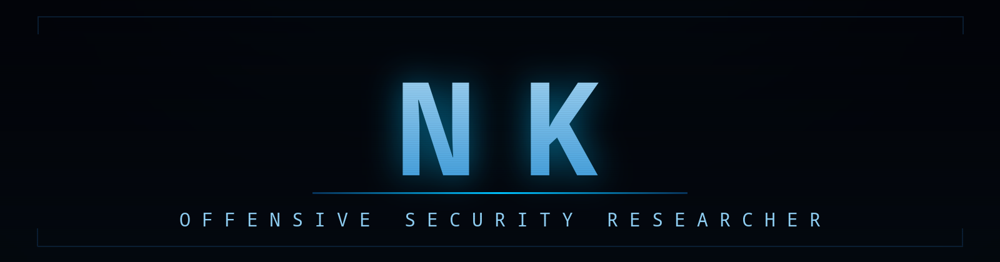
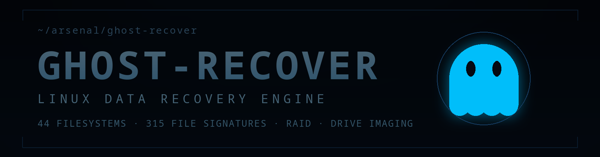
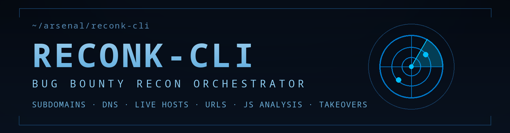

*I break web apps before bad actors do — and build the tooling while I'm at it.*

  
  
  

---

## `:~$` ls ~/arsenal

Flagship builds — the tools I'm known for. Star counts are live.

  
  
  

Recovers deleted files from 44 filesystems, carves 315 file formats by signature,
reassembles broken RAID arrays, images failing drives, and repairs damaged disks.

---

  
  
  

End-to-end bug bounty reconnaissance with an interactive TUI — subdomain enumeration,
DNS, live host filtering, ports, URL harvesting, params, JS analysis, tech fingerprinting
& subdomain takeover detection.

---

  <a href="https://github.com/nkbeast/DarkLens"><strong>DarkLens</strong></a>
  — Camera, location & voice-recorder attack surface research
  &nbsp;
  
  

<a href="https://github.com/nkbeast?tab=repositories">→ browse all repositories</a>

---

## `:~$` cat skills.matrix

**`// operations`**

  
  
  
  

**`// engineering`**

  
  
  
  

**`// stack`**

  
  
  
  
  
  
  

---

## `:~$` tail -f /var/log/activity

<table>
  <tr>
    <td width="50%">
      
    </td>
    <td width="50%">
      
    </td>
  </tr>
</table>

<table>
  <tr>
    <td width="50%">
      
    </td>
    <td width="50%">
      
    </td>
  </tr>
</table>

<picture>
  <source media="(prefers-color-scheme: dark)" srcset="https://raw.githubusercontent.com/nkbeast/nkbeast/output/github-contribution-grid-snake-blue-dark.svg" />
  <source media="(prefers-color-scheme: light)" srcset="https://raw.githubusercontent.com/nkbeast/nkbeast/output/github-contribution-grid-snake-blue.svg" />
  
</picture>

---

## `:~$` ssh socials

  
  
  
  
  

<code>./decrypt --classified</code>

 

- 🔍 Recon isn't a phase. It's an obsession.
- 📡 Current research: **zero-day attack surfaces & red team infrastructure**
- 💬 Ask me about bug bounty, VAPT, and building security tooling
- ⚡ `sleep` is a segmentation fault I haven't patched yet.

---

**`─── EOF ───`** &nbsp; `exit 0`

*open for collaboration — bug bounty, red team research, and security tooling*

